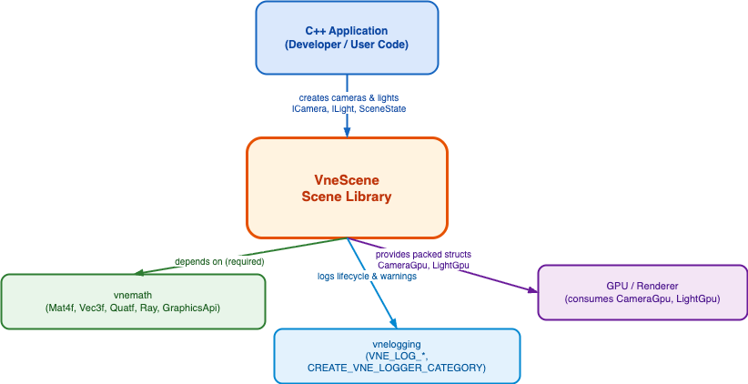
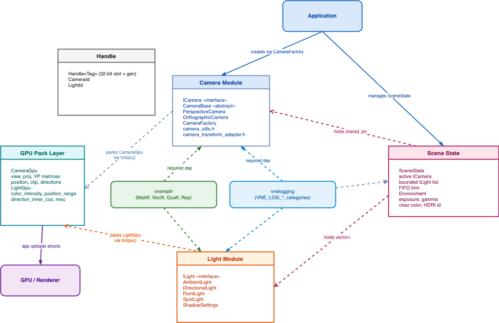
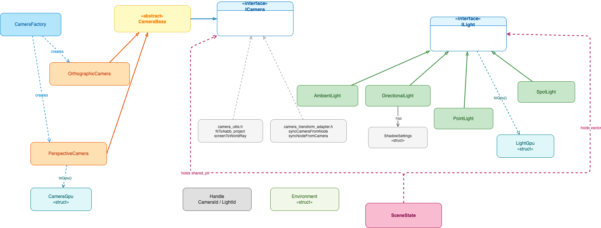

# Scene Module

## Overview

The Scene module provides cameras, lights, and scene state building blocks for VertexNova. It does not implement ECS, rendering, or input; it focuses on view (cameras) and lighting data with GPU-friendly packing for use by a renderer or viewer.



**Figure 1: Context Diagram**

| Element | Description |
|---------|-------------|
| C++ Application | Developer/user code that creates cameras, lights, and a `SceneState`, then drives the render loop |
| VneScene | Scene library; manages pose, projection, light parameters, GPU packing, and scene state |
| GPU / Renderer | Consumes `CameraGpu` and `LightGpu` packed structs uploaded by the application |
| vnemath | Required dependency; provides matrices, vectors, quaternions, rays, and graphics-API–specific projection utilities |
| vnelogging | Required dependency; provides `VNE_LOG_*` macros used internally for lifecycle and degenerate-input diagnostics |

**Key characteristics:**

- **Cameras**: Perspective and orthographic cameras with quaternion-native pose, lazy dirty-flag matrix evaluation, GPU pack layout, `fitToAabb`, `screenToWorldRay`, multi-backend projection (OpenGL, Vulkan, Metal), and transform-node sync.
- **Lights**: Ambient, directional, point, and spot lights with a common `LightGpu` layout and optional shadow settings on directional lights.
- **SceneState**: Move-only container holding a single active camera plus a bounded light list; suitable for sandbox and viewer use cases.
- **Handles**: Type-safe generational handles (`CameraId`, `LightId`) for stable identity without raw pointers.

## Architecture

The module follows a layered architecture with a clear interface/implementation split:

- **Interface Layer** (`ICamera`, `ILight`): polymorphic API consumed by the application and `SceneState`; no implementation details exposed.
- **Base Layer** (`CameraBase`): protected shared mixin providing quaternion pose state, dirty-flag tracking, and `lookAt` / `setTarget` / `setUp` helpers to concrete cameras. Not part of the public polymorphic API.
- **Concrete Layer** (`PerspectiveCamera`, `OrthographicCamera`, `AmbientLight`, `DirectionalLight`, `PointLight`, `SpotLight`): full implementations with projection-specific logic.
- **Utility Layer** (`CameraFactory`, `camera_utils.h`, `camera_transform_adapter.h`, GPU packing): stateless helpers and adapters.
- **State Layer** (`SceneState`, `Environment`): lightweight aggregates managing runtime scene data.



**Figure 2: Component Diagram**

| Component | Description |
|-----------|-------------|
| Camera Module | `ICamera`, `CameraBase`, `PerspectiveCamera`, `OrthographicCamera`, `CameraFactory`, `camera_utils.h`, `camera_transform_adapter.h` |
| Light Module | `ILight`, `AmbientLight`, `DirectionalLight`, `PointLight`, `SpotLight`, `ShadowSettings` |
| Scene State | `SceneState` (active camera + bounded light list), `Environment` (exposure, gamma, clear color, HDRI id) |
| GPU Pack Layer | `CameraGpu` (view/proj/VP matrices, position, clip planes, directions), `LightGpu` (color, range, direction, type flags) |
| Handle | `Handle<Tag>` (32-bit slot + 32-bit generation), `CameraId`, `LightId` |



**Figure 3: Class Diagram**

| Element | Description |
|---------|-------------|
| `ICamera` | Abstract camera interface; view/projection/VP matrices, quaternion pose, clip planes, resize, `lookAt`, scene scale, GPU pack |
| `CameraBase` | Protected mixin; stores `orientation_` (Quatf camera-to-world), `position_`, `look_distance_`, `up_hint_`; implements dirty-flag lazy evaluation |
| `PerspectiveCamera` | Perspective projection; FOV, aspect ratio or explicit width×height, movement helpers (`moveForward`, `moveRight`, `moveUp`, `orbit`) |
| `OrthographicCamera` | Orthographic projection; explicit LRTB bounds or width×height form; `setBounds`, `resize`, `getAspectRatio` |
| `CameraFactory` | Static factory; `createPerspective` / `createOrthographic` from typed or base `CameraParameters` |
| `ILight` | Abstract light interface; color, intensity, position/direction, enabled flag, `toGpu`, `update` |
| `AmbientLight` | Uniform ambient light; color and intensity only |
| `DirectionalLight` | Infinite directional light; normalized direction, optional shadow settings (`ShadowSettings`) |
| `PointLight` | Omnidirectional point light; position and range |
| `SpotLight` | Cone-shaped spot light; position, direction, inner/outer angle, range |
| `SceneState` | Move-only scene container; one active `ICamera`, bounded `vector<shared_ptr<ILight>>` with FIFO trim |
| `Environment` | Data-only environment settings; exposure, gamma, clear color, optional HDRI asset id |
| `Handle<Tag>` | 32-bit slot + 32-bit generation generational handle; `CameraId` and `LightId` are distinct instantiations |
| `CameraGpu` | GPU-ready packed camera struct; view, projection, VP (= **P*V**), position, clip planes, forward/right/up directions |
| `LightGpu` | GPU-ready packed light struct; `color_intensity`, `position_range`, `direction_inner_cos`, `misc` (type, enabled, outer cos) |

## Key Components

### Cameras

#### `ICamera`

Abstract base class defining the full camera interface. All operations are `noexcept`; degenerate inputs (zero vectors, coincident eye/target, out-of-range values) are handled by silent graceful fallbacks in the implementations.

**Key Methods:**

- `getPosition()` / `setPosition(pos)`: camera eye in world space
- `getTarget()` / `setTarget(target)`: derived look-at point (from orientation + look distance); setTarget recomputes orientation
- `getUp()` / `setUp(up)`: stored up hint; re-derives orientation for the current forward direction
- `getOrientation()`: camera-to-world rotation as `Quatf`; `getZAxis()` = back (+Z), `getYAxis()` = orthonormal up
- `setOrientationView(pos, orientation)`: atomic pose setter via quaternion; skips projection recompute
- `getForwardDir()` / `getRightDir()` / `getUpDir()`: orthonormal camera basis vectors derived from orientation
- `lookAt(pos, target, up)`: atomic three-parameter pose setter; marks view dirty once
- `lookAt(target, up)`: keeps current position, updates look direction
- `getViewMatrix()` / `getProjectionMatrix()` / `getViewProjectionMatrix()`: lazy-evaluated cached matrices (`getViewProjectionMatrix()` returns **projection * view**, i.e. P*V / clip-from-world)
- `updateViewMatrix()` / `updateProjectionMatrix()` / `updateMatrices()`: force recompute
- `resize(width, height)`: updates aspect ratio (perspective) or ortho bounds; recomputes projection
- `setClipPlanes(near, far)` / `getNearPlane()` / `getFarPlane()`: clip plane management with minimum enforcement
- `getSceneScale()` / `setSceneScale(scale)`: XY view-space zoom factor (default 1.0); clamped to `[1e-4f, +inf)`
- `setGraphicsApi(api)` / `getGraphicsApi()`: selects OpenGL, Vulkan, or Metal projection convention
- `getClipToScreenMatrix(width, height)`: NDC→screen transform for the chosen API
- `getCameraType()`: returns `CameraType::ePerspective` or `CameraType::eOrthographic`
- `toGpu()`: packs all camera state into a `CameraGpu` struct

#### `CameraBase`

Protected shared base (not part of the public polymorphic API) providing:

- Pose state: `orientation_` (Quatf camera-to-world), `position_`, `look_distance_`, `up_hint_`
- Dirty flags: `view_matrix_dirty_`, `projection_matrix_dirty_`, `vp_matrix_dirty_`
- `lookAtImpl(pos, target, up)` / `lookAtImpl(target, up)`: shared implementation using `resolveBackUnitAndLookDistance` + `orientationFromPosBack`
- `setTargetImpl` / `setUpImpl`: individual pose component setters
- `forwardDirImpl` / `rightDirImpl` / `upDirImpl`: basis vector helpers
- `viewFromQuaternion(api, scene_scale)`: builds the view matrix from quaternion + scene_scale factor
- `fitToAabbImpl`: shared AABB-fit logic for perspective cameras

**Design note:** Dirty-flag lazy evaluation uses `mutable` fields and `const_cast` for `const` getter paths. This is intentionally single-threaded; no external locking is provided.

#### `PerspectiveCamera`

Perspective camera with FOV-based projection.

**Additional Methods:**

- `getFieldOfView()` / `setFieldOfView(fov_deg)`: vertical FOV in degrees; clamped to `[1.0, 179.0]`
- `getAspectRatio()`: width / height
- `getWidth()` / `getHeight()`: stored viewport dimensions (set via `resize`)
- `moveForward(delta)` / `moveRight(delta)` / `moveUp(delta)`: position translation along camera axes
- `orbit(yaw_deg, pitch_deg)`: rotate around target while maintaining look distance

#### `OrthographicCamera`

Orthographic camera with explicit bounds projection.

**Additional Methods:**

- `setLeft(l)` / `setRight(r)` / `setBottom(b)` / `setTop(t)`: individual bound setters
- `setBounds(l, r, b, t, near, far)`: atomic full-bounds setter with degenerate-input guards
- `resize(width, height)`: recomputes symmetric LRTB from `[-w/2, w/2, -h/2, h/2]`
- `getAspectRatio()`: `(right - left) / (top - bottom)`

#### `CameraFactory`

Static factory for creating cameras via parameters.

**Methods:**

- `createPerspective(PerspectiveCameraParameters)`: returns `shared_ptr<PerspectiveCamera>`
- `createOrthographic(OrthographicCameraParameters)`: returns `shared_ptr<OrthographicCamera>`
- `create(CameraParameters)`: creates by `CameraType` enum; falls back to defaults if `dynamic_cast` fails (logged as WARN)

#### Camera Utilities (`camera_utils.h`)

| Function | Description |
|----------|-------------|
| `fitToAabb(cam, aabb, up)` | Moves perspective camera to see the full AABB; sets far plane to `distance + radius` |
| `project(cam, world_pos, viewport_w, viewport_h)` | Projects world point to screen pixel coordinates |
| `projectAabbCorners(cam, aabb, viewport_w, viewport_h)` | Projects all 8 AABB corners to screen space |
| `screenToWorldRay(cam, screen_x, screen_y, viewport_w, viewport_h)` | Generates a world-space ray from screen coordinates |

#### Camera Transform Adapter (`camera_transform_adapter.h`)

| Function | Description |
|----------|-------------|
| `syncCameraFromTransformNode(cam, node)` | Reads node's world matrix and sets camera position + orientation; forward = `-col2.normalized()` (right-handed GL convention) |
| `syncTransformNodeFromCamera(cam, node)` | Writes camera position and basis vectors into the node's world matrix |

### Lights

#### `ILight`

Abstract base class defining the light interface.

**Key Methods:**

- `getColor()` / `setColor(color)`: RGB light color
- `getIntensity()` / `setIntensity(intensity)`: clamped to `[0, +inf)`
- `getPosition()` / `setPosition(pos)`: world-space position (unused for ambient and directional)
- `getDirection()` / `setDirection(dir)`: normalized direction; near-zero vectors fall back to `(0,-1,0)`
- `isEnabled()` / `setEnabled(enabled)`: on/off toggle; packed into `LightGpu.misc.y`
- `getLightType()`: returns `LightType` enum (`eAmbient`, `eDirectional`, `ePoint`, `eSpot`)
- `getName()` / `setName(name)`: diagnostic label
- `update(delta_time)`: per-frame update hook
- `toGpu()`: packs light state into a `LightGpu` struct

#### Light GPU Layout (`LightGpu`)

All four light types share the same `LightGpu` struct packed into four `Float4` fields:

| Field | Contents |
|-------|---------|
| `color_intensity` | `(r, g, b, intensity)` |
| `position_range` | `(px, py, pz, range)` — range=0 for ambient/directional |
| `direction_inner_cos` | `(dx, dy, dz, cos(inner_angle))` — inner_cos=0 for non-spot |
| `misc` | `(type, enabled, outer_cos, 0)` — type: 0=Ambient, 1=Directional, 2=Point, 3=Spot |

#### Shadow Settings (`ShadowSettings`)

Available on `DirectionalLight` only:

| Method | Description |
|--------|-------------|
| `setShadowCasting(bool)` | Enable/disable shadow map generation |
| `setShadowMapSize(uint32_t)` | Shadow map resolution; rounded up to next power of 2 |
| `setShadowBias(float)` | Depth bias; clamped to `[0, +inf)` |
| `setShadowFarPlane(float)` | Far plane for shadow frustum; clamped to minimum 0.1 |

### Scene State and Environment

#### `SceneState`

Move-only container for runtime scene data.

**Methods:**

| Method | Description |
|--------|-------------|
| `setActiveCamera(shared_ptr<ICamera>)` | Set or clear the active camera |
| `getActiveCamera()` | Returns `shared_ptr<ICamera>` (may be null) |
| `hasActiveCamera()` | True if active camera is set |
| `addLight(shared_ptr<ILight>)` | Append a light; null lights are silently ignored (logged as WARN) |
| `removeLight(shared_ptr<ILight>)` | Remove a specific light |
| `getLights()` | Returns `const vector<shared_ptr<ILight>>&` |
| `setMaxLights(n)` | Set cap; FIFO-trims oldest lights when exceeded |
| `getMaxLights()` | Returns current cap |

**Design notes:**
- Move-only: `SceneState` has a deleted copy constructor and copy-assignment.
- `addLight` is O(N) when FIFO trimming fires (vector erase at begin).
- Max-light trimming logs an INFO message with the count of dropped lights.

#### `Environment`

Data-only struct for environment settings (no GPU textures; application manages any HDRI upload).

| Field | Description |
|-------|-------------|
| `exposure` | EV exposure adjustment |
| `gamma` | Gamma correction value |
| `clear_color` | Background clear color (`Vec4f`) |
| `hdri_asset_id` | Optional asset id for an HDRI background texture |

### Handles

`Handle<Tag>` — 32-bit slot + 32-bit generation generational handle. `CameraId` and `LightId` are distinct template instantiations to prevent cross-type misuse.

- `Handle::Make(slot, generation)`: factory function
- `Handle::slot()` / `Handle::generation()`: component accessors
- `Handle::isValid()`: returns true if slot is not `UINT32_MAX`
- `Handle::raw()`: packed 64-bit value for storage or comparison

### Umbrella Header

`scene.h` includes the full public API and provides `packLightGpu(ILight)` as a convenience wrapper.

## Logging

All implementation files (`*.cpp`) emit structured log messages through `vne::logging` using per-category names. Logging is a **required** CMake dependency (`vne::logging` linked `PUBLIC`); no logging calls are in hot per-frame paths.

**Log Categories:**

| Category | Source File(s) | What is logged |
|----------|---------------|----------------|
| `vnescene.camera` | `camera_base.cpp`, `perspective_camera.cpp`, `camera_factory.cpp` | Construction (INFO), degenerate eye==target (WARN), near-zero back vector (WARN), up parallel to look (WARN), FOV clamp (WARN), zero-height resize (WARN), non-positive scene scale (WARN), factory dynamic_cast failure (WARN) |
| `vnescene.orthographic_camera` | `orthographic_camera.cpp` | Construction (INFO), degenerate `setBounds` inputs (WARN), non-positive scene scale (WARN) |
| `vnescene.camera.utils` | `camera_utils.cpp` | Zero/negative AABB radius skip (WARN), zero/negative FOV tangent skip (WARN) |
| `vnescene.scene` | `scene_state.cpp` | Camera set/cleared (INFO), null light ignored (WARN), FIFO light trim count (INFO) |
| `vnescene.light` | `directional_light.cpp`, `point_light.cpp`, `spot_light.cpp` | Construction (INFO), near-zero direction fallback (WARN) |
| `vnescene.ambient_light` | `ambient_light.cpp` | Construction (INFO) |

**Usage pattern in library code:**

```cpp
#include <vertexnova/logging/logging.h>

namespace {
CREATE_VNE_LOGGER_CATEGORY("vnescene.camera")
}  // namespace

// construction
VNE_LOG_INFO << "PerspectiveCamera \"" << name_ << "\" created (fov=" << fov_ << "deg)";

// degenerate input
VNE_LOG_WARN << "CameraBase: eye and target coincide, preserving current orientation";
```

## Usage Examples

### Minimal: camera and scene state

```cpp
#include <vertexnova/scene/scene.h>

int main() {
    using namespace vne::scene;
    using namespace vne::math;

    auto camera = CameraFactory::createPerspective(
        PerspectiveCameraParameters(60.0f, 16.0f / 9.0f, 0.1f, 1000.0f));
    camera->lookAt(Vec3f(0.0f, 0.0f, 5.0f), Vec3f(0.0f, 0.0f, 0.0f), Vec3f(0.0f, 1.0f, 0.0f));
    camera->resize(800.0f, 600.0f);

    SceneState state;
    state.setActiveCamera(camera);
    state.addLight(std::make_shared<AmbientLight>(Vec3f(0.2f), 1.0f));

    if (state.hasActiveCamera()) {
        CameraGpu cam_gpu = state.getActiveCamera()->toGpu();
        // ... upload cam_gpu to GPU
    }
    return 0;
}
```

### Quaternion pose

```cpp
#include <vertexnova/scene/scene.h>

using namespace vne::scene;
using namespace vne::math;

// Set pose via quaternion (e.g. imported from an animation or transform node)
Quatf orientation = Quatf::fromAxisAngle(Vec3f(0.0f, 1.0f, 0.0f), degToRad(45.0f));
camera->setOrientationView(Vec3f(3.0f, 2.0f, 3.0f), orientation);

// Read back orthonormal basis
Vec3f forward = camera->getForwardDir();   // -Z in camera space
Vec3f right   = camera->getRightDir();
Vec3f up      = camera->getUpDir();
```

### Multi-backend projection

```cpp
#include <vertexnova/scene/scene.h>
#include <vertexnova/math/core/graphics_api.h>

using namespace vne::scene;
using namespace vne::math;

// Switch to Vulkan NDC (Y-flipped, depth [0,1])
camera->setGraphicsApi(GraphicsApi::eVulkan);
Mat4f proj_vk = camera->getProjectionMatrix();

// Switch to OpenGL NDC (depth [-1,1])
camera->setGraphicsApi(GraphicsApi::eOpenGL);
Mat4f proj_gl = camera->getProjectionMatrix();
```

### Fit camera to AABB and screen ray

```cpp
#include <vertexnova/scene/camera/camera_utils.h>

using namespace vne::scene;
using namespace vne::math;

// Fit perspective camera so the entire AABB is in view
fitToAabb(*camera, aabb, Vec3f(0.0f, 1.0f, 0.0f));

// Cast a ray from a screen pixel into the scene
auto ray = screenToWorldRay(*camera, mouse_x, mouse_y, 1280.0f, 720.0f);
```

### Lights and GPU packing

```cpp
#include <vertexnova/scene/scene.h>

using namespace vne::scene;
using namespace vne::math;

SceneState state;
state.setMaxLights(8);

auto ambient = std::make_shared<AmbientLight>(Vec3f(1.0f), 0.1f, "ambient");
auto sun = std::make_shared<DirectionalLight>(Vec3f(0.0f, -1.0f, 0.0f), Vec3f(1.0f), 3.0f, "sun");
sun->setShadowCasting(true);
sun->setShadowMapSize(2048);

auto spot = std::make_shared<SpotLight>(
    Vec3f(0.0f, 5.0f, 0.0f), Vec3f(0.0f, -1.0f, 0.0f),
    Vec3f(1.0f, 0.8f, 0.6f), 10.0f, 20.0f, 15.0f, 30.0f, "key_spot");

state.addLight(ambient);
state.addLight(sun);
state.addLight(spot);

// Pack all lights for GPU upload
std::vector<LightGpu> gpu_lights;
for (auto& light : state.getLights()) {
    gpu_lights.push_back(light->toGpu());
}
```

### Camera transform sync

```cpp
#include <vertexnova/scene/camera/camera_transform_adapter.h>

using namespace vne::scene;

// Sync camera pose from a scene graph transform node
syncCameraFromTransformNode(*camera, transform_node);

// Write camera pose back into a transform node
syncTransformNodeFromCamera(*camera, transform_node);
```

See also **examples 01–07** under [`examples/`](../../../examples/README.md).

## Best Practices

### Camera Setup

- Prefer `lookAt(pos, target, up)` for initial placement; use `setOrientationView` when importing quaternion poses from a scene graph or animation.
- Always call `resize(w, h)` when the viewport changes; do not rely on construction-time dimensions if the window can be resized.
- Use `setGraphicsApi` once at startup; mixing APIs within the same frame is not supported.
- `getUp()` returns the stored up **hint**, not the orthonormal basis up — use `getUpDir()` when you need the true camera basis Y.

### Light Management

- `SceneState::addLight` trims from the front of the list (FIFO) when `max_lights` is exceeded — order matters for priority.
- Always call `setEnabled(false)` rather than removing and re-adding a light when toggling visibility; removal is O(N).
- `SpotLight` inner angle must be ≤ outer angle; the constructor and `setInnerOuterAnglesDeg` enforce this automatically.

### GPU Packing

- Call `toGpu()` only when the camera or light state has changed; avoid calling per-vertex or per-draw.
- `CameraGpu` stores the VP matrix pre-multiplied as `projection * view`; use it directly for `gl_Position = vp * model * pos`.

## Testing

Unit tests cover camera construction, matrix correctness, degenerate-input handling, GPU packing, scene state lifecycle, handle operations, and light serialization.

Run tests:

```bash
cmake -B build -DVNE_SCENE_TESTS=ON
cmake --build build
ctest --output-on-failure
```

Or with both tests and examples:

```bash
cmake -B build -DVNE_SCENE_DEV=ON
cmake --build build
ctest --output-on-failure
```

Key test files:

| File | Coverage |
|------|---------|
| `perspective_camera_test.cpp` | FOV clamp, resize, aspect ratio, zero-height guard, scene scale clamp |
| `orthographic_camera_test.cpp` | Bounds, near/far clamp, setBounds degenerate, scene scale clamp |
| `camera_utils_test.cpp` | `fitToAabb` far-plane extension, `screenToWorldRay` |
| `camera_transform_adapter_test.cpp` | Forward direction correctness, round-trip stability |
| `scene_state_test.cpp` | Move construct/assign, null light guard, FIFO trim |

## Dependencies

| Dependency | Required | Notes |
|------------|----------|-------|
| **vnemath** | Yes | Matrices, vectors, quaternions, rays, graphics-API projection utilities |
| **vnelogging** | Yes (if target exists) | `VNE_LOG_*` macros; linked `PUBLIC` via `if(TARGET vne::logging)` guard in CMake |

## See Also

- [Documentation index](../../README.md) — how to generate API documentation (Doxygen).
- [Examples](../../../examples/README.md) — 01_basic through 07_camera_transform_sync.
- [Diagrams](diagrams/README.md) — draw.io source files: `context.drawio`, `component.drawio`, `class.drawio`; export instructions for PNG.
- [vnelogging](../../../../vnelogging/docs/vertexnova/logging/logging.md) — logging configuration, categories, and pattern reference.
